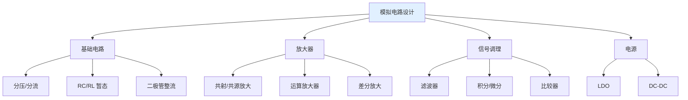

# 可视化：模拟电路层次

## 模拟电路能力层级

```mermaid
graph TB
    A[模拟电路设计] --> B[基础电路]
    A --> C[放大器]
    A --> D[信号调理]
    A --> E[电源]
    
    B --> B1[分压/分流]
    B --> B2[RC/RL 暂态]
    B --> B3[二极管整流]
    
    C --> C1[共射/共源放大]
    C --> C2[运算放大器]
    C --> C3[差分放大]
    
    D --> D1[滤波器]
    D --> D2[积分/微分]
    D --> D3[比较器]
    
    E --> E1[LDO]
    E --> E2[DC-DC]
    
    style A fill:#e1f0ff
```

### 模拟设计流程

```mermaid
graph LR
    A[指标定义] --> B[拓扑选择]
    B --> C[手工估算]
    C --> D[LTspice 仿真]
    D --> E[面包板验证]
    E --> F[PCB 实现]
    F --> G[实测调优]
    
    style G fill:#e1f5e1
```

---

