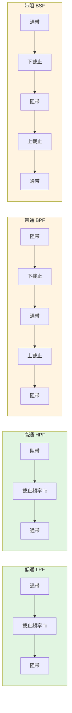
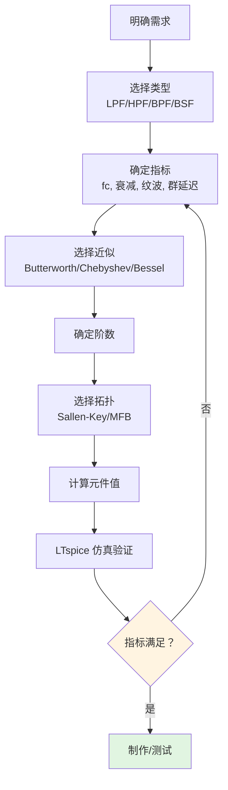
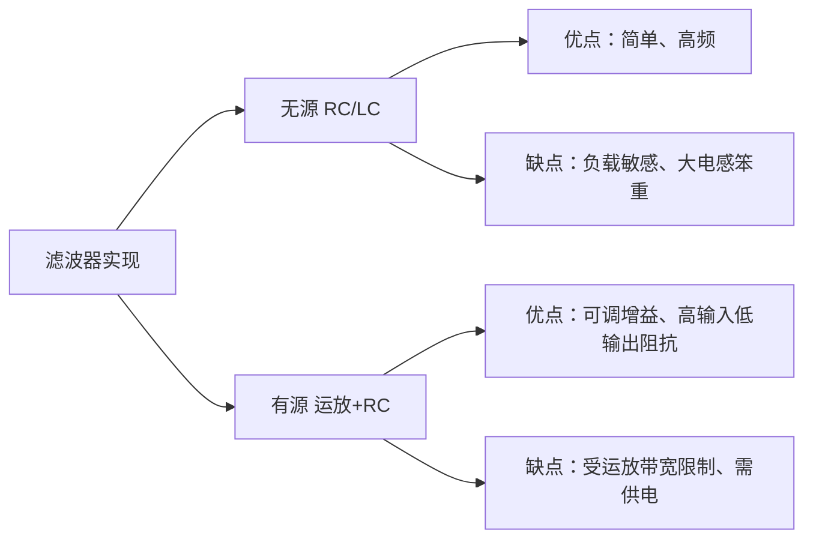

# 可视化：滤波器类型与设计流程

## 滤波器频率响应示意

```mermaid
graph LR
    subgraph LPF["低通 LPF"]
        direction TB
        A1[通带] --> B1[截止频率 fc] --> C1[阻带]
    end
    
    subgraph HPF["高通 HPF"]
        direction TB
        A2[阻带] --> B2[截止频率 fc] --> C2[通带]
    end
    
    subgraph BPF["带通 BPF"]
        direction TB
        A3[阻带] --> B3[下截止] --> C3[通带] --> D3[上截止] --> E3[阻带]
    end
    
    subgraph BSF["带阻 BSF"]
        direction TB
        A4[通带] --> B4[下截止] --> C4[阻带] --> D4[上截止] --> E4[通带]
    end
    
    style LPF fill:#e1f5e1
    style HPF fill:#e1f5e1
    style BPF fill:#fff4e1
    style BSF fill:#fff4e1
```

### 滤波器设计流程

```mermaid
graph TB
    A[明确需求] --> B["选择类型<br/>LPF/HPF/BPF/BSF"]
    B --> C["确定指标<br/>fc, 衰减, 纹波, 群延迟"]
    C --> D["选择近似<br/>Butterworth/Chebyshev/Bessel"]
    D --> E[确定阶数]
    E --> F["选择拓扑<br/>Sallen-Key/MFB"]
    F --> G[计算元件值]
    G --> H[LTspice 仿真验证]
    H --> I{指标满足？}
    I -->|否| C
    I -->|是| J[制作/测试]
    
    style J fill:#e1f5e1
    style I fill:#fff4e1
```

### 无源 vs 有源滤波器对比

```mermaid
graph LR
    A[滤波器实现] --> B["无源 RC/LC"]
    A --> C["有源 运放+RC"]
    
    B --> B1["优点：简单、高频"]
    B --> B2["缺点：负载敏感、大电感笨重"]
    
    C --> C1["优点：可调增益、高输入低输出阻抗"]
    C --> C2["缺点：受运放带宽限制、需供电"]
```

---

