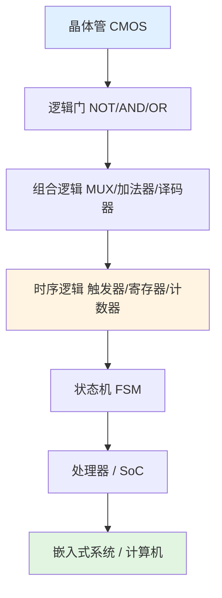
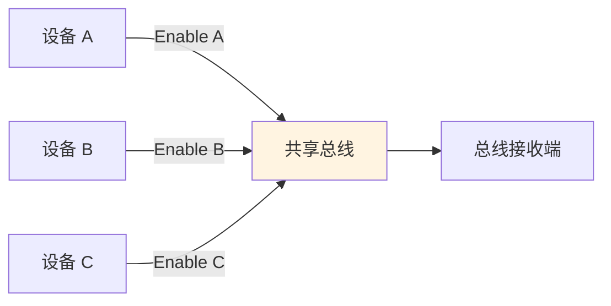

# 可视化：数字逻辑层次结构

## 从晶体管到系统

```mermaid
graph TB
    A[晶体管 CMOS] --> B[逻辑门 NOT/AND/OR]
    B --> C[组合逻辑 MUX/加法器/译码器]
    C --> D[时序逻辑 触发器/寄存器/计数器]
    D --> E[状态机 FSM]
    E --> F[处理器 / SoC]
    F --> G[嵌入式系统 / 计算机]
    
    style A fill:#e1f0ff
    style D fill:#fff4e1
    style G fill:#e1f5e1
```

### 组合逻辑设计流程

```mermaid
graph LR
    A[真值表] --> B[布尔表达式]
    B --> C[卡诺图化简]
    C --> D[逻辑门电路]
    D --> E[Verilog/VHDL]
    E --> F[仿真验证]
    
    style A fill:#e1f0ff
    style F fill:#e1f5e1
```

### 三态门与总线共享

```mermaid
graph LR
    A[设备 A] -->|Enable A| BUS["共享总线"]
    B[设备 B] -->|Enable B| BUS
    C[设备 C] -->|Enable C| BUS
    BUS --> D[总线接收端]
    
    style BUS fill:#fff4e1
```

---

