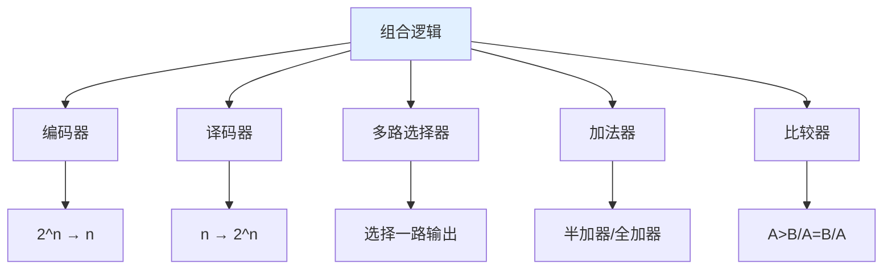

# 可视化：组合逻辑电路

## 组合逻辑基本单元

```mermaid
graph TB
    A[组合逻辑] --> B[编码器]
    A --> C[译码器]
    A --> D[多路选择器]
    A --> E[加法器]
    A --> F[比较器]
    
    B --> B1[2^n → n]
    C --> C1[n → 2^n]
    D --> D1[选择一路输出]
    E --> E1[半加器/全加器]
    F --> F1["A>B/A=B/A<B"]
    
    style A fill:#e1f0ff
```

### 组合逻辑设计流程

```mermaid
graph LR
    A[真值表] --> B[布尔表达式]
    B --> C[卡诺图化简]
    C --> D[逻辑门电路]
    D --> E[Verilog 描述]
    E --> F[仿真验证]
    
    style F fill:#e1f5e1
```

---

