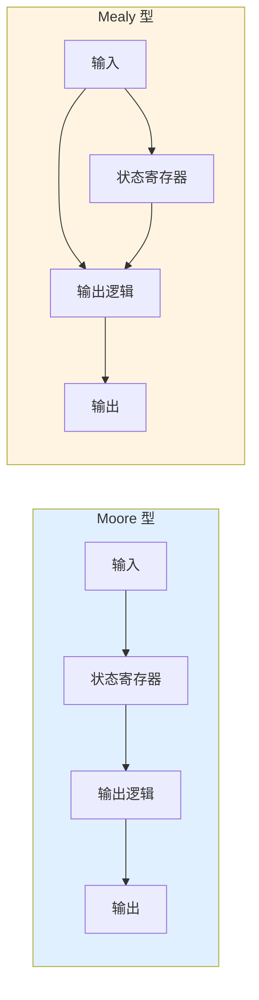
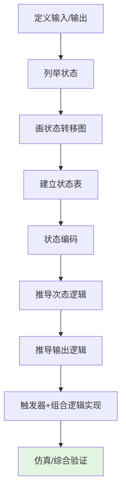
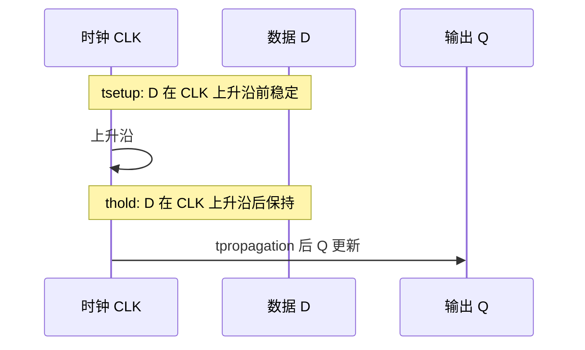
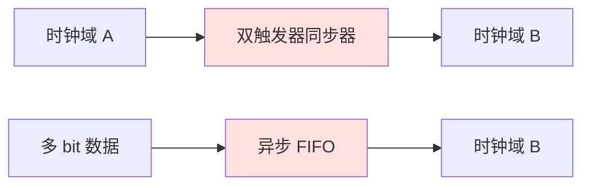

# 可视化：状态机与时序

## Moore 型 vs Mealy 型状态机

```mermaid
graph LR
    subgraph Moore["Moore 型"]
        A1[输入] --> B1[状态寄存器]
        B1 --> C1[输出逻辑]
        C1 --> D1[输出]
    end
    
    subgraph Mealy["Mealy 型"]
        A2[输入] --> B2[状态寄存器]
        A2 --> C2[输出逻辑]
        B2 --> C2
        C2 --> D2[输出]
    end
    
    style Moore fill:#e1f0ff
    style Mealy fill:#fff4e1
```

### 状态机设计流程

```mermaid
graph TB
    A[定义输入/输出] --> B[列举状态]
    B --> C[画状态转移图]
    C --> D[建立状态表]
    D --> E[状态编码]
    E --> F[推导次态逻辑]
    F --> G[推导输出逻辑]
    G --> H[触发器+组合逻辑实现]
    H --> I[仿真/综合验证]
    
    style I fill:#e1f5e1
```

### 建立时间与保持时间时序图

```mermaid
sequenceDiagram
    participant CLK as 时钟 CLK
    participant D as 数据 D
    participant Q as 输出 Q
    
    Note over D,CLK: tsetup: D 在 CLK 上升沿前稳定
    CLK->>CLK: 上升沿
    Note over D,CLK: thold: D 在 CLK 上升沿后保持
    CLK->>Q: tpropagation 后 Q 更新
```

### 时钟域交叉（CDC）处理

```mermaid
graph LR
    A[时钟域 A] --> B["双触发器同步器"]
    B --> C[时钟域 B]
    
    D[多 bit 数据] --> E["异步 FIFO"]
    E --> F[时钟域 B]
    
    style B fill:#ffe1e1
    style E fill:#ffe1e1
```

---

