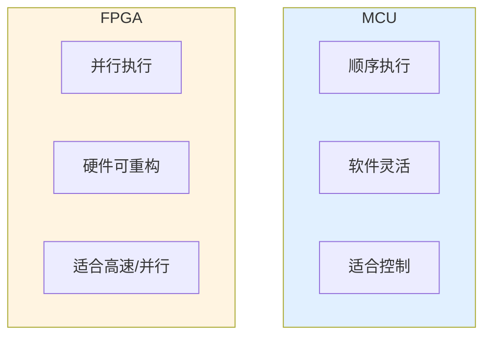

# 可视化：FPGA 开发流程

## FPGA 设计流程

```mermaid
graph LR
    A[需求分析] --> B[RTL 设计]
    B --> C[功能仿真]
    C --> D[综合]
    D --> E[布局布线]
    E --> F[时序分析]
    F --> G[比特流生成]
    G --> H[上板验证]
    
    style H fill:#e1f5e1
```

### FPGA 与 MCU 对比

```mermaid
graph TB
    subgraph MCU["MCU"]
        M1[顺序执行]
        M2[软件灵活]
        M3[适合控制]
    end
    
    subgraph FPGA["FPGA"]
        F1[并行执行]
        F2[硬件可重构]
        F3[适合高速/并行]
    end
    
    style MCU fill:#e1f0ff
    style FPGA fill:#fff4e1
```

---

