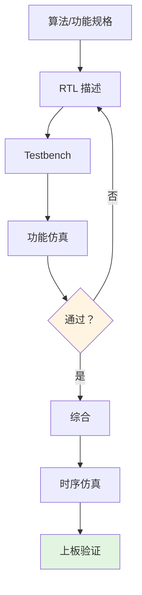
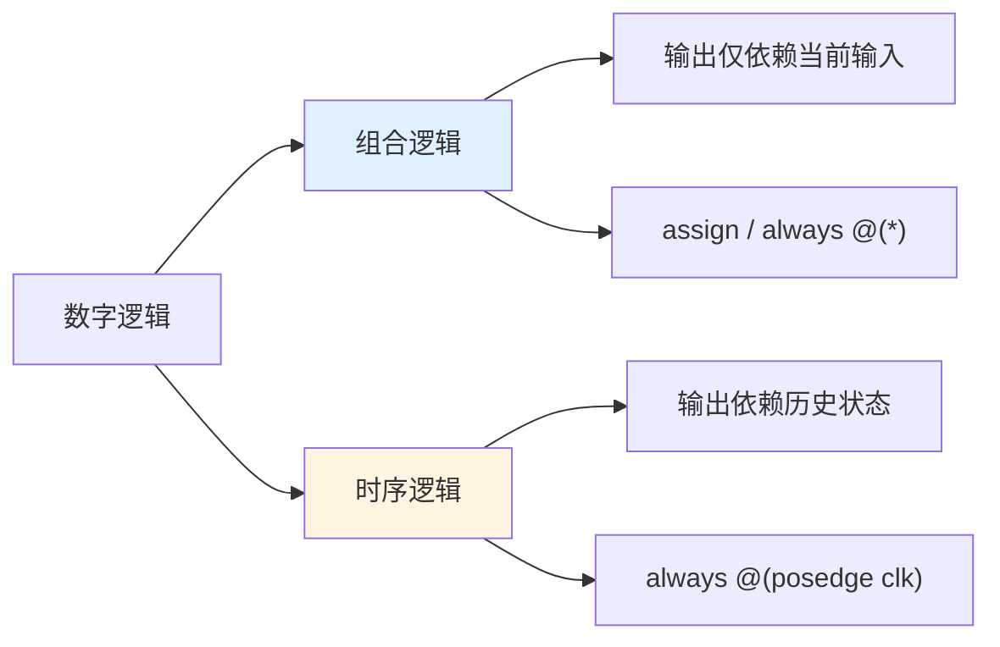

# 可视化：Verilog 设计流程

## 从算法到硬件

```mermaid
graph TB
    A[算法/功能规格] --> B[RTL 描述]
    B --> C[Testbench]
    C --> D[功能仿真]
    D --> E{通过？}
    E -->|否| B
    E -->|是| F[综合]
    F --> G[时序仿真]
    G --> H[上板验证]
    
    style H fill:#e1f5e1
    style E fill:#fff4e1
```

### 组合逻辑 vs 时序逻辑

```mermaid
graph LR
    A[数字逻辑] --> B[组合逻辑]
    A --> C[时序逻辑]
    
    B --> B1[输出仅依赖当前输入]
    B --> B2["assign / always @(*)"]
    
    C --> C1[输出依赖历史状态]
    C --> C2["always @(posedge clk)"]
    
    style B fill:#e1f0ff
    style C fill:#fff4e1
```

---

