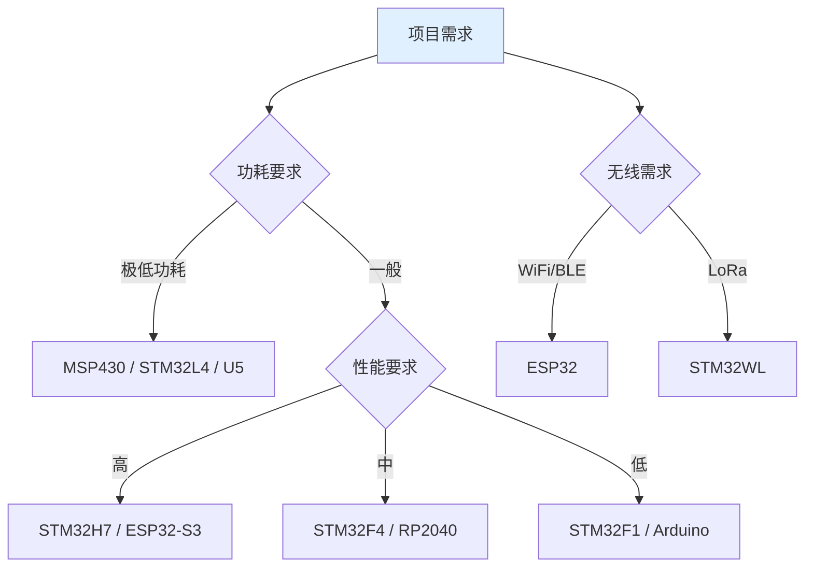
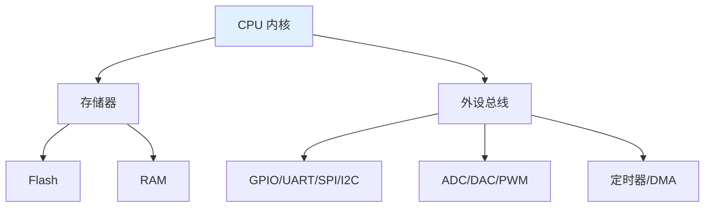

# 可视化：MCU 选型与应用

## MCU 选型决策树

```mermaid
graph TB
    A[项目需求] --> B{功耗要求}
    B -->|极低功耗| C[MSP430 / STM32L4 / U5]
    B -->|一般| D{性能要求}
    D -->|高| E[STM32H7 / ESP32-S3]
    D -->|中| F[STM32F4 / RP2040]
    D -->|低| G[STM32F1 / Arduino]
    A --> H{无线需求}
    H -->|WiFi/BLE| I[ESP32]
    H -->|LoRa| J[STM32WL]
    
    style A fill:#e1f0ff
```

### MCU 系统框图

```mermaid
graph TB
    A[CPU 内核] --> B[存储器]
    A --> C[外设总线]
    C --> D[GPIO/UART/SPI/I2C]
    C --> E[ADC/DAC/PWM]
    C --> F[定时器/DMA]
    B --> G[Flash]
    B --> H[RAM]
    
    style A fill:#e1f0ff
```

---

