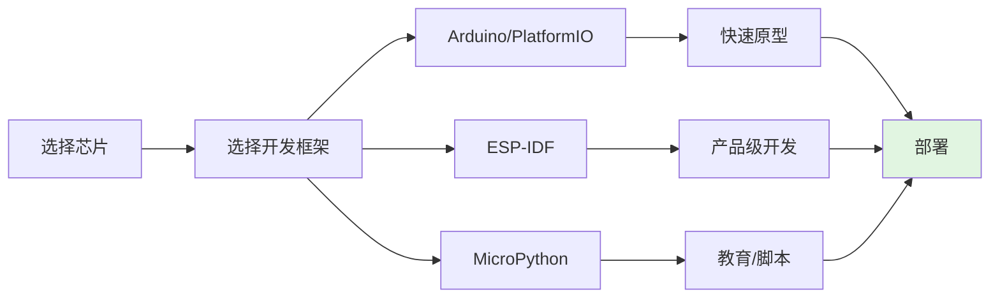
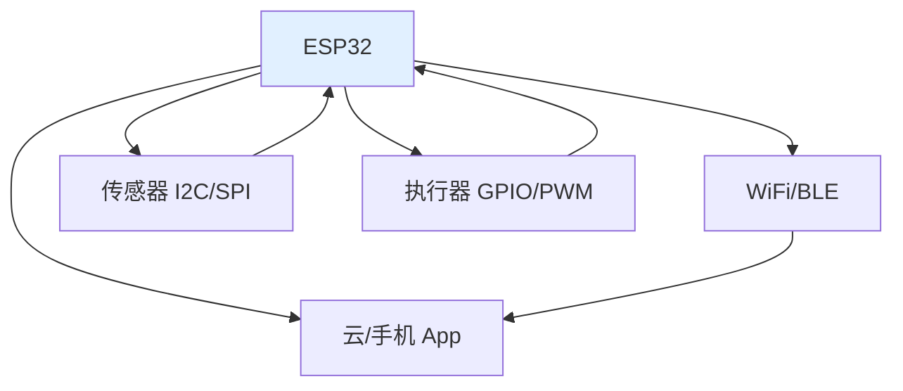

# 可视化：ESP32 生态与应用

## ESP32 开发流程

```mermaid
graph LR
    A[选择芯片] --> B[选择开发框架]
    B --> C[Arduino/PlatformIO]
    B --> D[ESP-IDF]
    B --> E[MicroPython]
    C --> F[快速原型]
    D --> G[产品级开发]
    E --> H[教育/脚本]
    F --> I[部署]
    G --> I
    H --> I
    
    style I fill:#e1f5e1
```

### ESP32 典型应用框图

```mermaid
graph TB
    A[ESP32] --> B[WiFi/BLE]
    A --> C[传感器 I2C/SPI]
    A --> D[执行器 GPIO/PWM]
    A --> E[云/手机 App]
    
    B --> E
    C --> A
    D --> A
    
    style A fill:#e1f0ff
```

---

