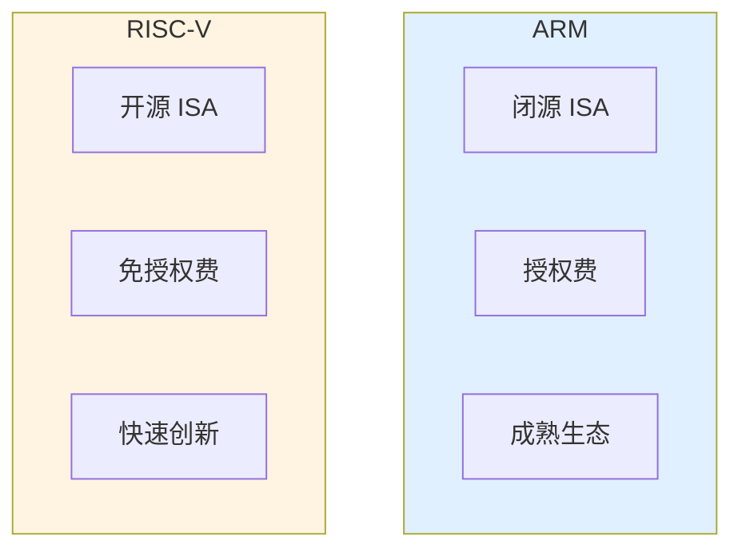
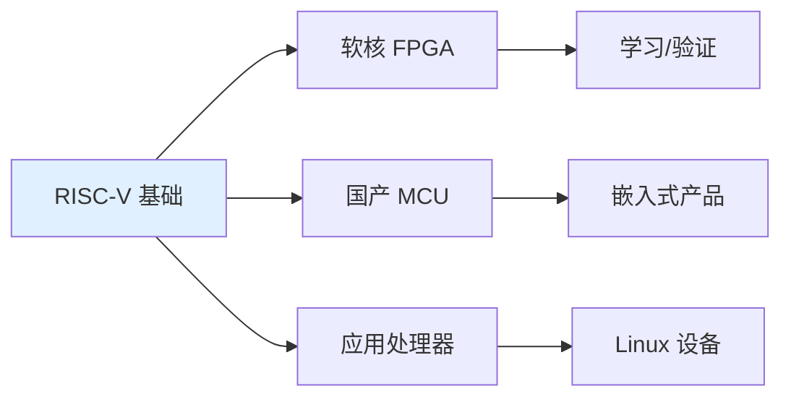

# 可视化：RISC-V 生态

## RISC-V 与 ARM 对比

```mermaid
graph TB
    subgraph ARM["ARM"]
        A1[闭源 ISA]
        A2[授权费]
        A3[成熟生态]
    end
    
    subgraph RISCV["RISC-V"]
        R1[开源 ISA]
        R2[免授权费]
        R3[快速创新]
    end
    
    style ARM fill:#e1f0ff
    style RISCV fill:#fff4e1
```

### RISC-V 应用路径

```mermaid
graph LR
    A[RISC-V 基础] --> B[软核 FPGA]
    A --> C[国产 MCU]
    A --> D[应用处理器]
    B --> E[学习/验证]
    C --> F[嵌入式产品]
    D --> G[Linux 设备]
    
    style A fill:#e1f0ff
```

---

