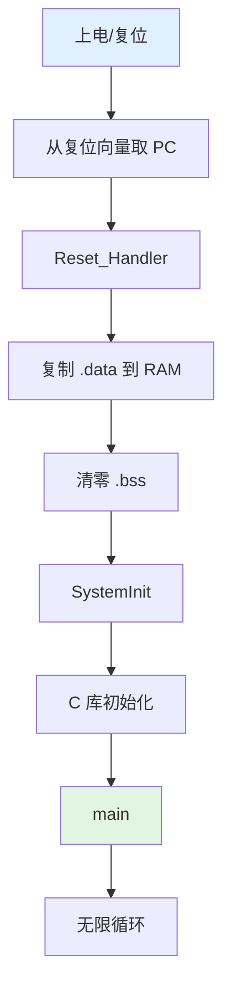
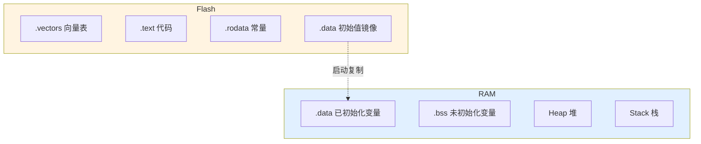
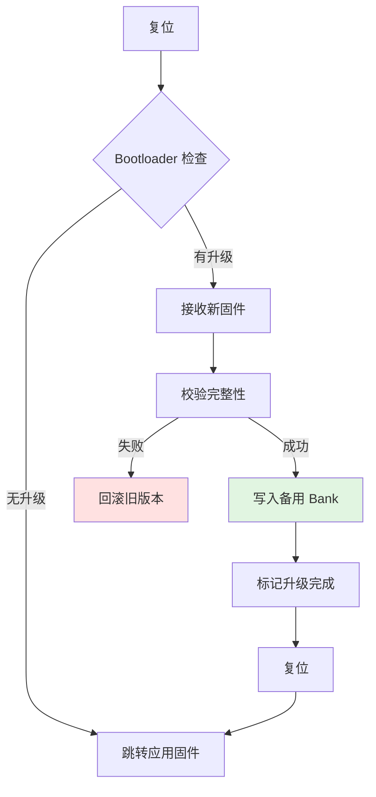

# 可视化：启动流程与内存布局

## 上电到 main() 的启动流程

```mermaid
graph TB
    A[上电/复位] --> B[从复位向量取 PC]
    B --> C[Reset_Handler]
    C --> D[复制 .data 到 RAM]
    D --> E[清零 .bss]
    E --> F[SystemInit]
    F --> G[C 库初始化]
    G --> H[main]
    H --> I[无限循环]
    
    style A fill:#e1f0ff
    style H fill:#e1f5e1
```

### 内存段布局

```mermaid
graph TB
    subgraph Flash["Flash"]
        F1[.vectors 向量表]
        F2[.text 代码]
        F3[.rodata 常量]
        F4[.data 初始值镜像]
    end
    
    subgraph RAM["RAM"]
        R1[.data 已初始化变量]
        R2[.bss 未初始化变量]
        R3[Heap 堆]
        R4[Stack 栈]
    end
    
    F4 -.->|启动复制| R1
    
    style Flash fill:#fff4e1
    style RAM fill:#e1f0ff
```

### Bootloader 与 OTA 流程

```mermaid
graph TB
    A[复位] --> B{Bootloader 检查}
    B -->|无升级| C[跳转应用固件]
    B -->|有升级| D[接收新固件]
    D --> E[校验完整性]
    E -->|失败| F[回滚旧版本]
    E -->|成功| G[写入备用 Bank]
    G --> H[标记升级完成]
    H --> I[复位]
    I --> C
    
    style G fill:#e1f5e1
    style F fill:#ffe1e1
```

---

