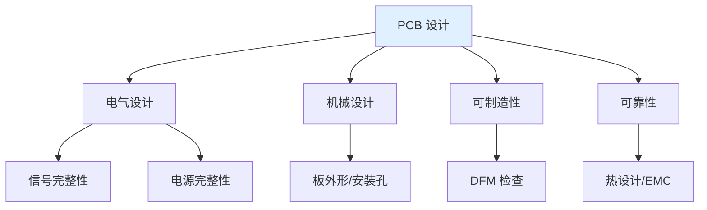

# 可视化：PCB 设计流程

## 从原理图到成品

```mermaid
graph LR
    A[需求分析] --> B[元器件选型]
    B --> C[原理图设计]
    C --> D[PCB 布局]
    D --> E[布线]
    E --> F[DRC 检查]
    F --> G[Gerber 输出]
    G --> H[打样制造]
    H --> I[焊接调试]
    
    style I fill:#e1f5e1
```

### PCB 设计层次

```mermaid
graph TB
    A[PCB 设计] --> B[电气设计]
    A --> C[机械设计]
    A --> D[可制造性]
    A --> E[可靠性]
    
    B --> B1[信号完整性]
    B --> B2[电源完整性]
    C --> C1[板外形/安装孔]
    D --> D1[DFM 检查]
    E --> E1[热设计/EMC]
    
    style A fill:#e1f0ff
```

---

