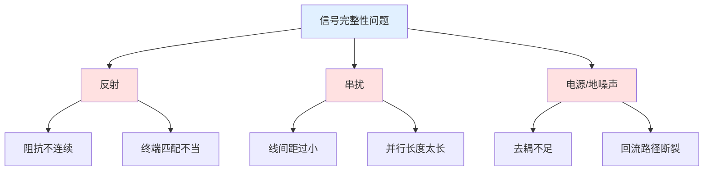

# 可视化：信号完整性问题因果

## 高速信号三大问题

```mermaid
graph TB
    A[信号完整性问题] --> B[反射]
    A --> C[串扰]
    A --> D[电源/地噪声]
    
    B --> B1[阻抗不连续]
    B --> B2[终端匹配不当]
    
    C --> C1[线间距过小]
    C --> C2[并行长度太长]
    
    D --> D1[去耦不足]
    D --> D2[回流路径断裂]
    
    style A fill:#e1f0ff
    style B fill:#ffe1e1
    style C fill:#ffe1e1
    style D fill:#ffe1e1
```

### 信号完整性与频率

```mermaid
graph LR
    A["低速 <10MHz"] --> B[去耦+接地]
    B --> C[中速 10-100MHz]
    C --> D[阻抗匹配+串扰]
    D --> E["高速 >100MHz"]
    E --> F[仿真+眼图]
    
    style E fill:#fff4e1
```

---

