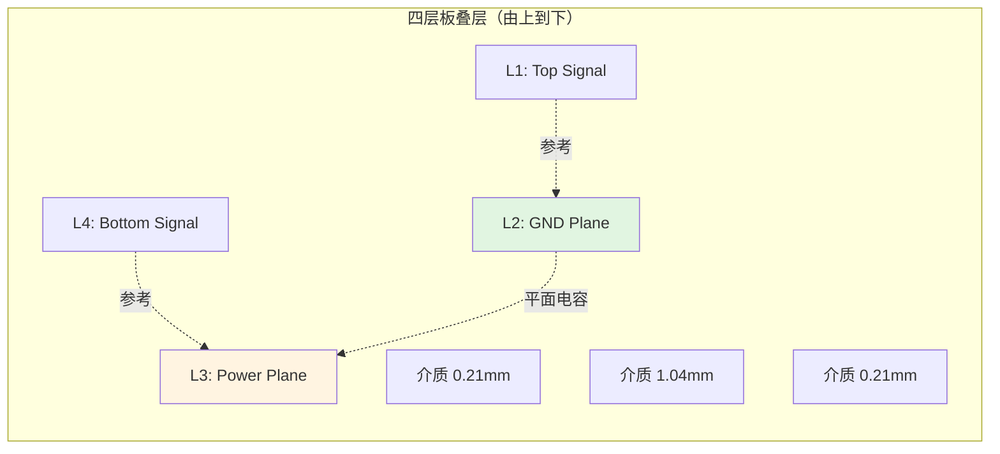
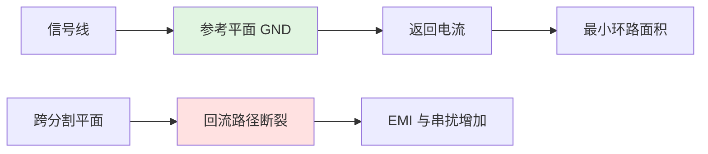
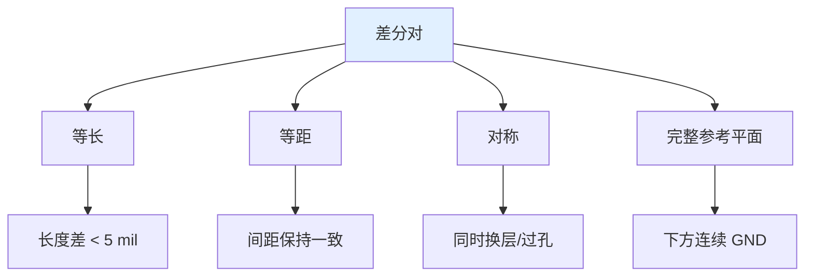

# 可视化：PCB 叠层与回流

## 四层板标准叠层

```mermaid
graph TB
    subgraph Stack["四层板叠层（由上到下）"]
        direction TB
        L1["L1: Top Signal"]
        D1["介质 0.21mm"]
        L2["L2: GND Plane"]
        D2["介质 1.04mm"]
        L3["L3: Power Plane"]
        D3["介质 0.21mm"]
        L4["L4: Bottom Signal"]
    end
    
    L1 -.参考.-> L2
    L4 -.参考.-> L3
    L2 -.平面电容.-> L3
    
    style L2 fill:#e1f5e1
    style L3 fill:#fff4e1
```

### 高速信号回流路径

```mermaid
graph LR
    A[信号线] --> B[参考平面 GND]
    B --> C[返回电流]
    C --> D[最小环路面积]
    
    E[跨分割平面] --> F[回流路径断裂]
    F --> G[EMI 与串扰增加]
    
    style B fill:#e1f5e1
    style F fill:#ffe1e1
```

### 阻抗设计流程

```mermaid
graph LR
    A[确定目标阻抗] --> B[获取板材参数]
    B --> C[计算线宽/间距]
    C --> D[板厂仿真确认]
    D --> E[制板打样]
    E --> F[阻抗测试 coupon]
    F --> G[验证合格]
    
    style G fill:#e1f5e1
```

### 差分对设计原则

```mermaid
graph TB
    A[差分对] --> B[等长]
    A --> C[等距]
    A --> D[对称]
    A --> E[完整参考平面]
    
    B --> F["长度差 < 5 mil"]
    C --> G[间距保持一致]
    D --> H[同时换层/过孔]
    E --> I[下方连续 GND]
    
    style A fill:#e1f0ff
```

---

