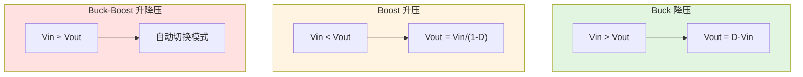
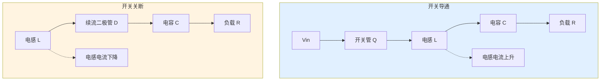
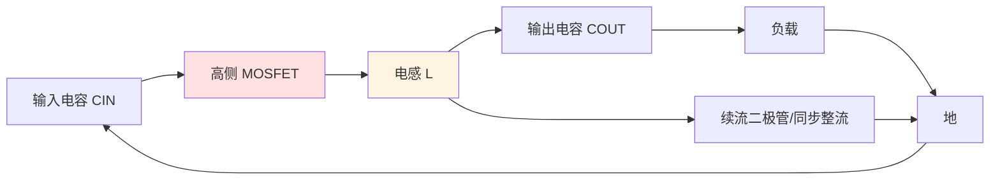

# 可视化：DC-DC 拓扑与工作流程

## Buck / Boost / Buck-Boost 拓扑对比

```mermaid
graph TB
    subgraph BUCK["Buck 降压"]
        B1["Vin > Vout"] --> B2["Vout = D·Vin"]
    end
    
    subgraph BOOST["Boost 升压"]
        C1["Vin < Vout"] --> C2["Vout = Vin/(1-D)"]
    end
    
    subgraph BB["Buck-Boost 升降压"]
        D1[Vin ≈ Vout] --> D2["自动切换模式"]
    end
    
    style BUCK fill:#e1f5e1
    style BOOST fill:#fff4e1
    style BB fill:#ffe1e1
```

### Buck 工作阶段

```mermaid
graph TB
    subgraph ON["开关导通"]
        A1[Vin] --> A2[开关管 Q]
        A2 --> A3[电感 L]
        A3 --> A4[电容 C]
        A4 --> A5[负载 R]
        A3 -.-> A6[电感电流上升]
    end
    
    subgraph OFF["开关关断"]
        B1[电感 L] --> B2[续流二极管 D]
        B2 --> B3[电容 C]
        B3 --> B4[负载 R]
        B1 -.-> B5[电感电流下降]
    end
    
    style ON fill:#e1f0ff
    style OFF fill:#fff4e1
```

### DC-DC 设计流程

```mermaid
graph LR
    A[确定 Vin/Vout/Iout] --> B[选择拓扑]
    B --> C[选择 IC]
    C --> D[计算 L/C]
    D --> E[设计补偿]
    E --> F[PCB 布局]
    F --> G[LTspice 仿真]
    G --> H[实测验证]
    
    style H fill:#e1f5e1
```

### 关键电流路径

```mermaid
graph LR
    A[输入电容 CIN] --> B[高侧 MOSFET]
    B --> C[电感 L]
    C --> D[输出电容 COUT]
    D --> E[负载]
    E --> F[地]
    F --> A
    C --> G[续流二极管/同步整流]
    G --> F
    
    style B fill:#ffe1e1
    style C fill:#fff4e1
```

---

