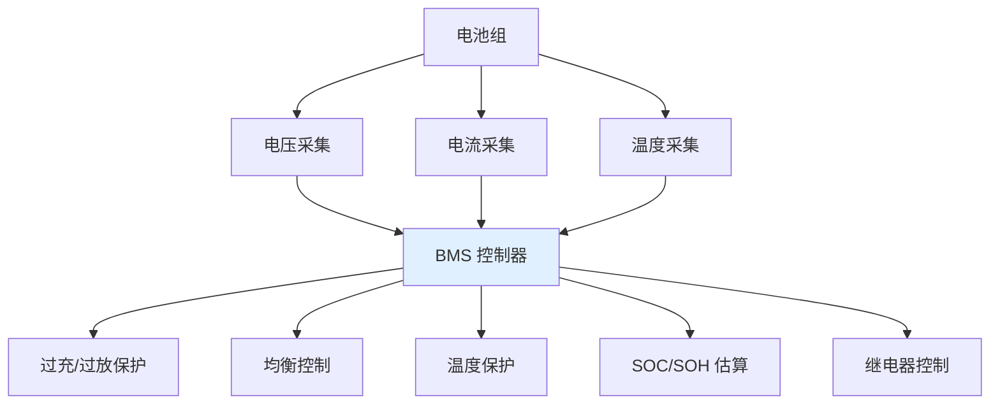

# 可视化：BMS 功能框图

## BMS 核心功能

```mermaid
graph TB
    A[电池组] --> B[电压采集]
    A --> C[电流采集]
    A --> D[温度采集]
    
    B --> E[BMS 控制器]
    C --> E
    D --> E
    
    E --> F[过充/过放保护]
    E --> G[均衡控制]
    E --> H[温度保护]
    E --> I[SOC/SOH 估算]
    E --> J[继电器控制]
    
    style E fill:#e1f0ff
```

### 电池充电阶段

```mermaid
graph LR
    A[涓流充电] --> B[恒流充电]
    B --> C[恒压充电]
    C --> D[充电截止]
    
    style D fill:#e1f5e1
```

---

