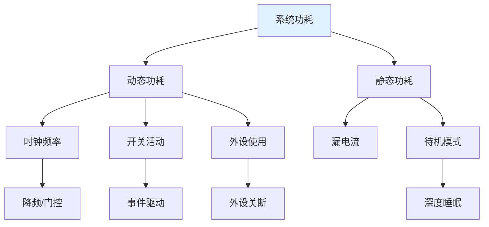
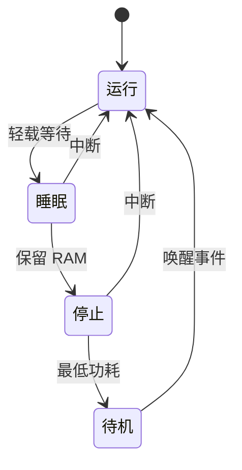

# 可视化：低功耗设计策略

## 功耗来源与优化

```mermaid
graph TB
    A[系统功耗] --> B[动态功耗]
    A --> C[静态功耗]
    
    B --> B1[时钟频率]
    B --> B2[开关活动]
    B --> B3[外设使用]
    
    C --> C1[漏电流]
    C --> C2[待机模式]
    
    B1 --> D[降频/门控]
    B2 --> E[事件驱动]
    B3 --> F[外设关断]
    C2 --> G[深度睡眠]
    
    style A fill:#e1f0ff
```

### MCU 低功耗模式

```mermaid
stateDiagram-v2
    [*] --> 运行
    运行 --> 睡眠: 轻载等待
    睡眠 --> 停止: 保留 RAM
    停止 --> 待机: 最低功耗
    待机 --> 运行: 唤醒事件
    睡眠 --> 运行: 中断
    停止 --> 运行: 中断
```

---

