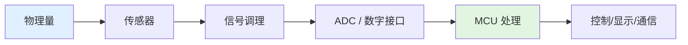
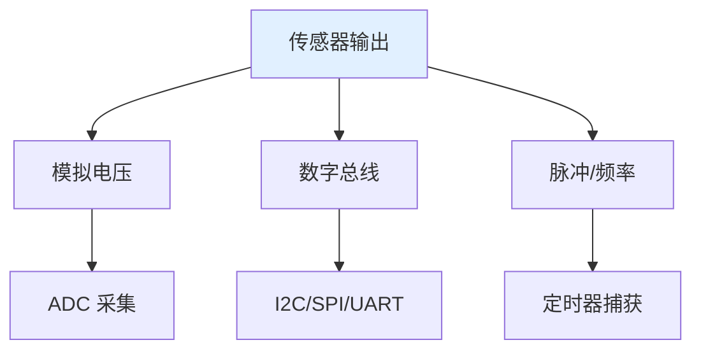

# 可视化：传感器接口选择

## 传感器信号链

```mermaid
graph LR
    A[物理量] --> B[传感器]
    B --> C[信号调理]
    C --> D[ADC / 数字接口]
    D --> E[MCU 处理]
    E --> F[控制/显示/通信]
    
    style A fill:#e1f0ff
    style E fill:#e1f5e1
```

### 按输出类型选择接口

```mermaid
graph TB
    A[传感器输出] --> B[模拟电压]
    A --> C[数字总线]
    A --> D[脉冲/频率]
    
    B --> E[ADC 采集]
    C --> F[I2C/SPI/UART]
    D --> G[定时器捕获]
    
    style A fill:#e1f0ff
```

---

