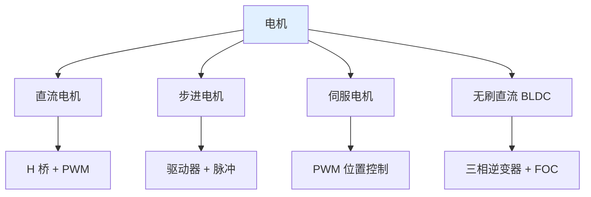
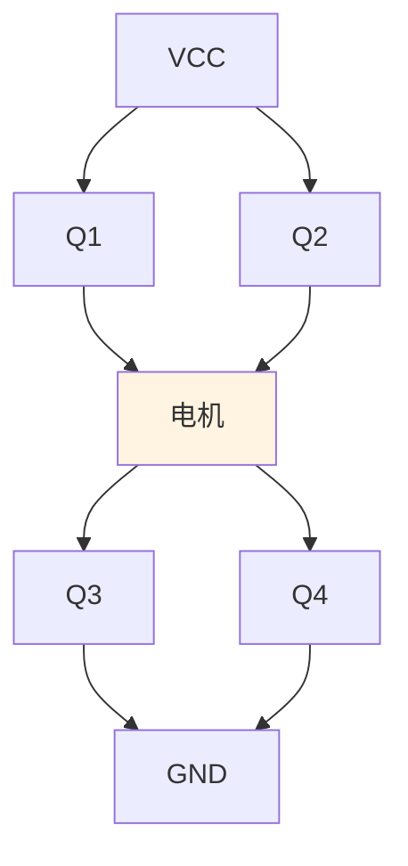

# 可视化：电机驱动拓扑

## 常见电机类型与驱动

```mermaid
graph TB
    A[电机] --> B[直流电机]
    A --> C[步进电机]
    A --> D[伺服电机]
    A --> E[无刷直流 BLDC]
    
    B --> B1[H 桥 + PWM]
    C --> C1[驱动器 + 脉冲]
    D --> D1[PWM 位置控制]
    E --> E1[三相逆变器 + FOC]
    
    style A fill:#e1f0ff
```

### H 桥基本结构

```mermaid
graph TB
    A[VCC] --> B[Q1]
    A --> C[Q2]
    B --> D[电机]
    C --> D
    D --> E[Q3]
    D --> F[Q4]
    E --> G[GND]
    F --> G
    
    style D fill:#fff4e1
```

---

