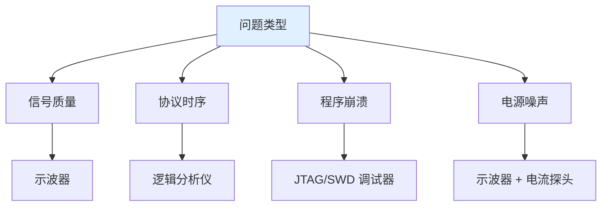

# 可视化：调试方法论

## 系统化调试流程

```mermaid
graph LR
    A[复现问题] --> B[假设原因]
    B --> C[设计实验]
    C --> D[采集数据]
    D --> E[验证假设]
    E -->|不成立| B
    E -->|成立| F[修复验证]
    
    style F fill:#e1f5e1
```

### 工具按问题类型选择

```mermaid
graph TB
    A[问题类型] --> B[信号质量]
    A --> C[协议时序]
    A --> D[程序崩溃]
    A --> E[电源噪声]
    
    B --> F[示波器]
    C --> G[逻辑分析仪]
    D --> H[JTAG/SWD 调试器]
    E --> I[示波器 + 电流探头]
    
    style A fill:#e1f0ff
```

---

