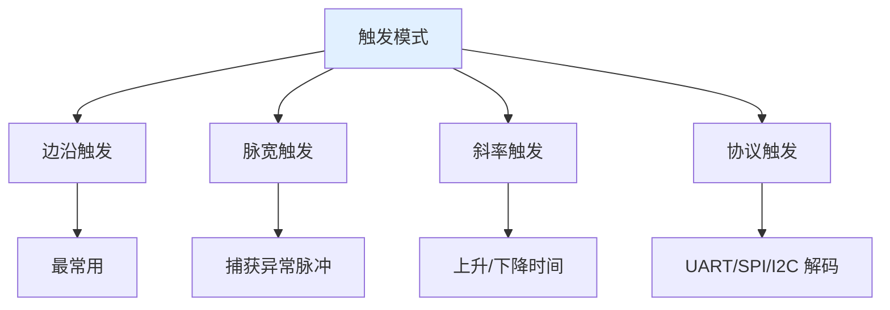
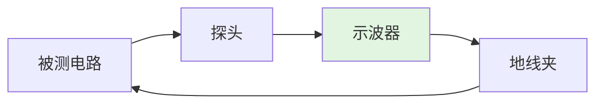

# 可视化：示波器触发与测量

## 示波器触发模式选择

```mermaid
graph TB
    A[触发模式] --> B[边沿触发]
    A --> C[脉宽触发]
    A --> D[斜率触发]
    A --> E[协议触发]
    
    B --> B1[最常用]
    C --> C1[捕获异常脉冲]
    D --> D1[上升/下降时间]
    E --> E1[UART/SPI/I2C 解码]
    
    style A fill:#e1f0ff
```

### 典型测量连接

```mermaid
graph LR
    A[被测电路] --> B[探头]
    B --> C[示波器]
    C --> D[地线夹]
    D --> A
    
    style C fill:#e1f5e1
```

---

