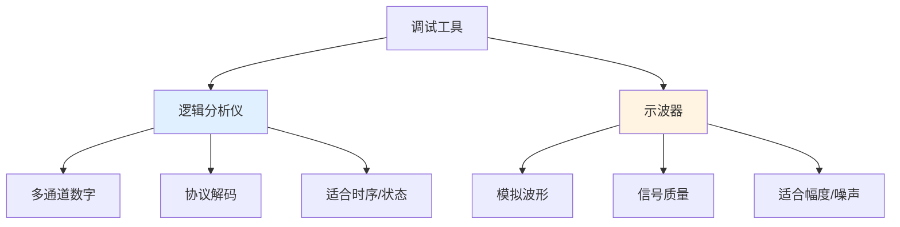

# 可视化：逻辑分析仪使用流程

## 数字调试工作流

```mermaid
graph LR
    A[连接探头] --> B[配置通道]
    B --> C[设置触发]
    C --> D[启动采集]
    D --> E[协议解码]
    E --> F[分析时序]
    
    style F fill:#e1f5e1
```

### 与示波器对比

```mermaid
graph TB
    A[调试工具] --> B[逻辑分析仪]
    A --> C[示波器]
    
    B --> B1[多通道数字]
    B --> B2[协议解码]
    B --> B3[适合时序/状态]
    
    C --> C1[模拟波形]
    C --> C2[信号质量]
    C --> C3[适合幅度/噪声]
    
    style B fill:#e1f0ff
    style C fill:#fff4e1
```

---

