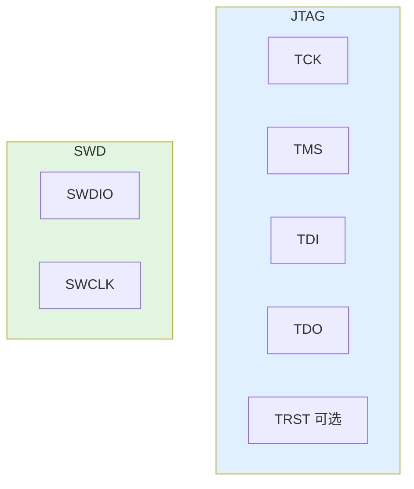

# 可视化：JTAG vs SWD

## 调试接口对比

```mermaid
graph TB
    subgraph JTAG["JTAG"]
        J1[TCK]
        J2[TMS]
        J3[TDI]
        J4[TDO]
        J5[TRST 可选]
    end
    
    subgraph SWD["SWD"]
        S1[SWDIO]
        S2[SWCLK]
    end
    
    style JTAG fill:#e1f0ff
    style SWD fill:#e1f5e1
```

### 调试数据流

```mermaid
graph LR
    A[PC IDE] --> B[调试器]
    B --> C[JTAG/SWD]
    C --> D[目标 MCU]
    D --> C
    C --> B
    B --> A
    
    style D fill:#e1f0ff
```

---

