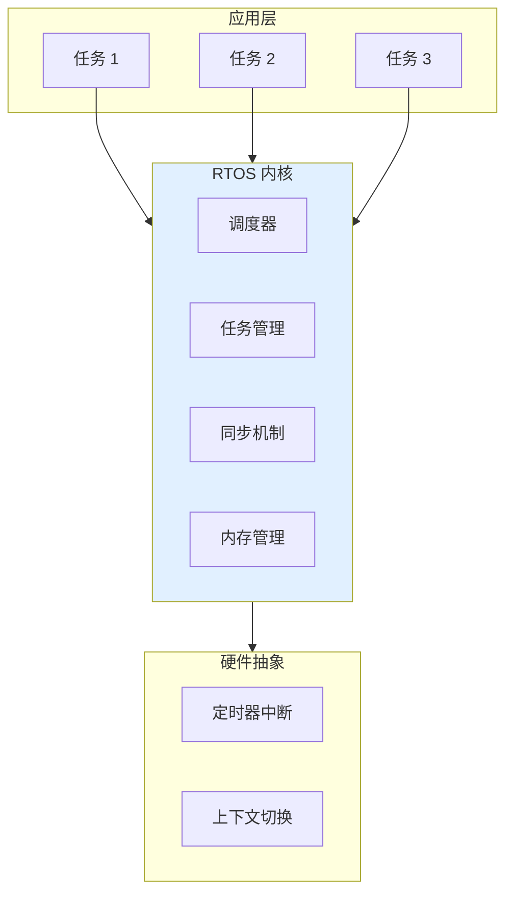
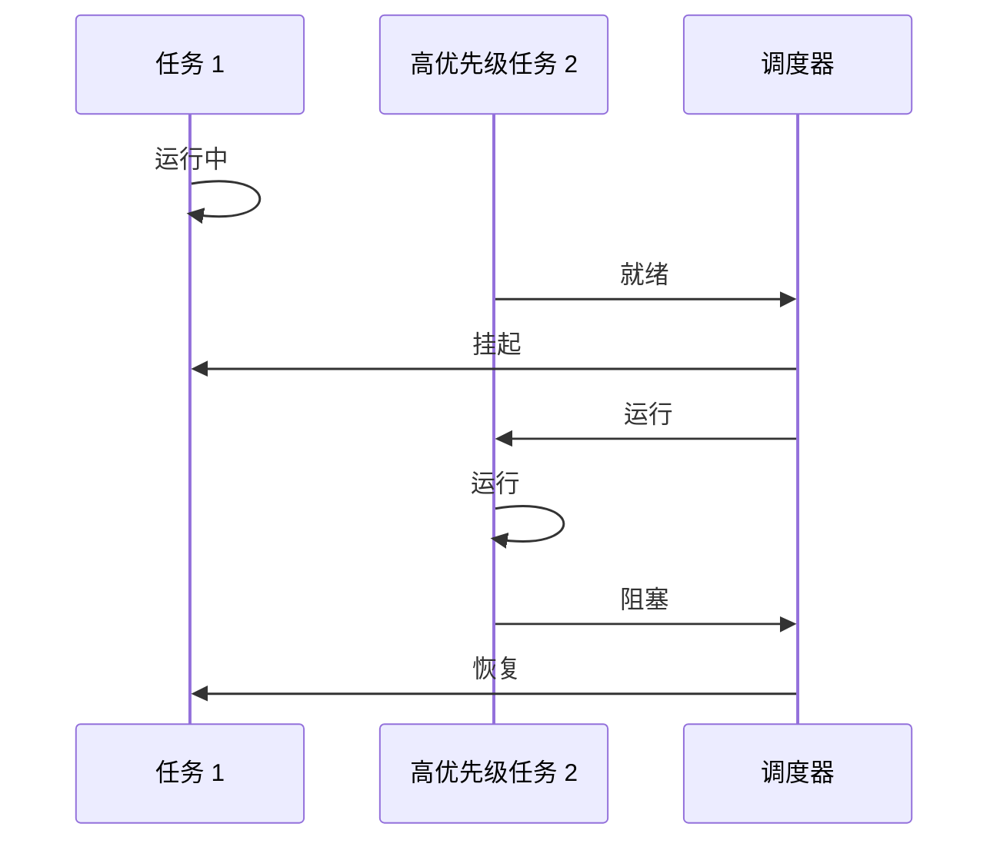

# 可视化：RTOS 架构

## RTOS 在嵌入式系统中的位置

```mermaid
graph TB
    subgraph APP["应用层"]
        A1[任务 1]
        A2[任务 2]
        A3[任务 3]
    end
    
    subgraph RTOS["RTOS 内核"]
        R1[调度器]
        R2[任务管理]
        R3[同步机制]
        R4[内存管理]
    end
    
    subgraph HAL["硬件抽象"]
        H1[定时器中断]
        H2[上下文切换]
    end
    
    A1 --> RTOS
    A2 --> RTOS
    A3 --> RTOS
    RTOS --> HAL
    
    style RTOS fill:#e1f0ff
```

### 抢占式调度时序

```mermaid
sequenceDiagram
    participant T1 as 任务 1
    participant T2 as 高优先级任务 2
    participant Sched as 调度器
    
    T1->>T1: 运行中
    T2->>Sched: 就绪
    Sched->>T1: 挂起
    Sched->>T2: 运行
    T2->>T2: 运行
    T2->>Sched: 阻塞
    Sched->>T1: 恢复
```

---

