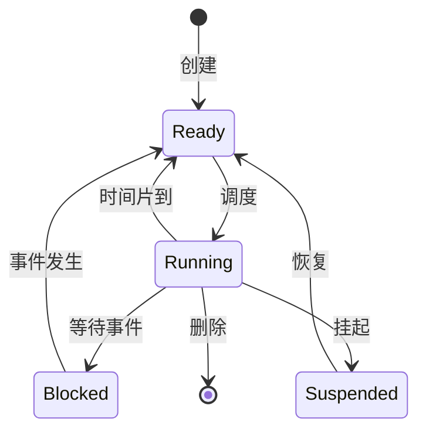
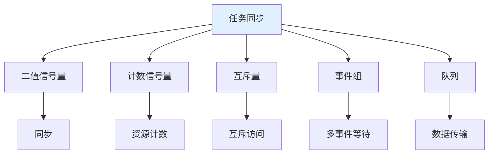

# 可视化：FreeRTOS 任务状态

## 任务生命周期

```mermaid
stateDiagram-v2
    [*] --> Ready: 创建
    Ready --> Running: 调度
    Running --> Ready: 时间片到
    Running --> Blocked: 等待事件
    Blocked --> Ready: 事件发生
    Running --> Suspended: 挂起
    Suspended --> Ready: 恢复
    Running --> [*]: 删除
```

### 任务间同步机制

```mermaid
graph TB
    A[任务同步] --> B[二值信号量]
    A --> C[计数信号量]
    A --> D[互斥量]
    A --> E[事件组]
    A --> F[队列]
    
    B --> B1[同步]
    C --> C1[资源计数]
    D --> D1[互斥访问]
    E --> E1[多事件等待]
    F --> F1[数据传输]
    
    style A fill:#e1f0ff
```

---

