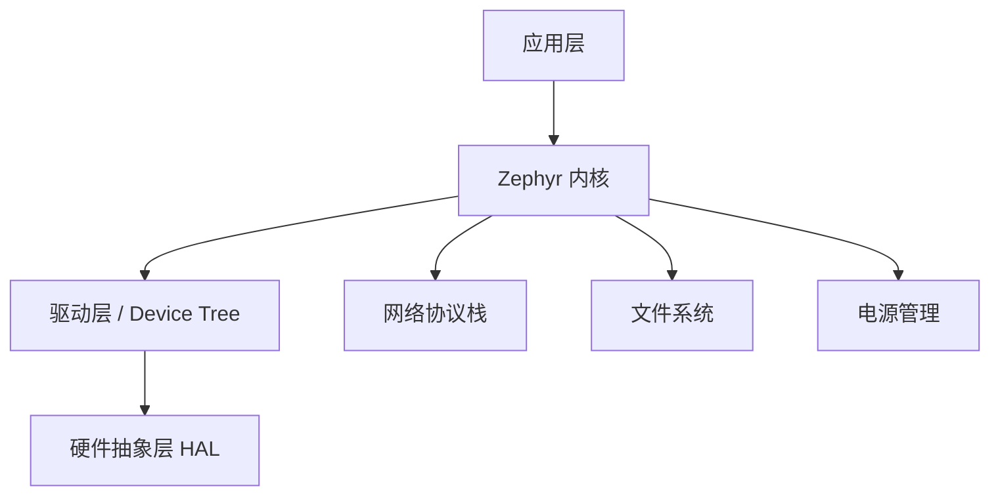

# 架构

```mermaid
graph TD
    A[应用层] --> B[Zephyr 内核]
    B --> C[驱动层 / Device Tree]
    C --> D[硬件抽象层 HAL]
    B --> E[网络协议栈]
    B --> F[文件系统]
    B --> G[电源管理]
```

- **Kconfig**：配置系统，决定编译哪些功能和驱动
- **Device Tree**：描述硬件资源和中断
- **West**：构建和项目管理工具（类似 repo）
- **POSIX API**：部分兼容，方便 Linux 开发者迁移
- **用户空间/内核空间**：支持 MMU/MPU 的隔离

---

