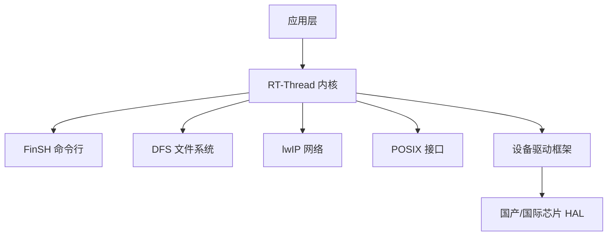

# 架构

```mermaid
graph TD
    A[应用层] --> B[RT-Thread 内核]
    B --> C[FinSH 命令行]
    B --> D[DFS 文件系统]
    B --> E[lwIP 网络]
    B --> F[POSIX 接口]
    B --> G[设备驱动框架]
    G --> H[国产/国际芯片 HAL]
```

- **内核**：线程调度、同步、通信、内存管理、中断
- **组件**：FinSH（命令行）、DFS（文件系统）、lwIP（网络）、POSIX
- **软件包**：包管理器（pkgs），类似 Python pip 或 Node npm
- **驱动框架**：统一设备驱动模型（I/O 设备、总线设备）

---

