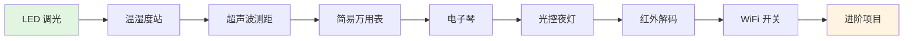

# 可视化：入门项目学习路径

```mermaid
graph LR
    A[LED 调光] --> B[温湿度站]
    B --> C[超声波测距]
    C --> D[简易万用表]
    D --> E[电子琴]
    E --> F[光控夜灯]
    F --> G[红外解码]
    G --> H[WiFi 开关]
    H --> I[进阶项目]
    
    style A fill:#e1f5e1
    style I fill:#fff4e1
```

---

