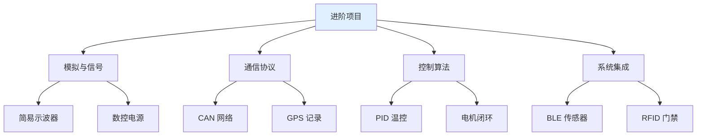

# 可视化：进阶项目能力栈

```mermaid
graph TB
    A[进阶项目] --> B[模拟与信号]
    A --> C[通信协议]
    A --> D[控制算法]
    A --> E[系统集成]
    
    B --> B1[简易示波器]
    B --> B2[数控电源]
    C --> C1[CAN 网络]
    C --> C2[GPS 记录]
    D --> D1[PID 温控]
    D --> D2[电机闭环]
    E --> E1[BLE 传感器]
    E --> E2[RFID 门禁]
    
    style A fill:#e1f0ff
```

---

