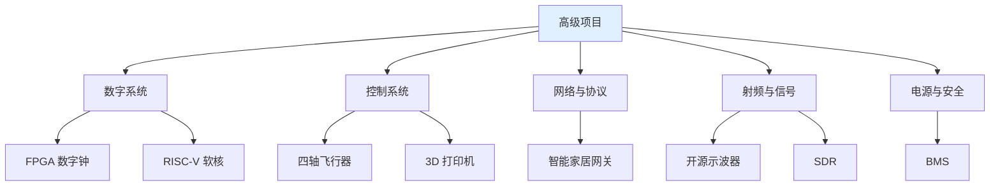

# 可视化：高级项目技术地图

```mermaid
graph TB
    A[高级项目] --> B[数字系统]
    A --> C[控制系统]
    A --> D[网络与协议]
    A --> E[射频与信号]
    A --> F[电源与安全]
    
    B --> B1[FPGA 数字钟]
    B --> B2[RISC-V 软核]
    C --> C1[四轴飞行器]
    C --> C2[3D 打印机]
    D --> D1[智能家居网关]
    E --> E1[开源示波器]
    E --> E2[SDR]
    F --> F1[BMS]
    
    style A fill:#e1f0ff
```

---

