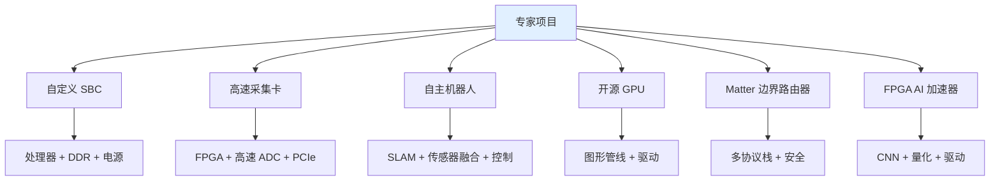

# 可视化：专家项目技术栈

```mermaid
graph TB
    A[专家项目] --> B[自定义 SBC]
    A --> C[高速采集卡]
    A --> D[自主机器人]
    A --> E[开源 GPU]
    A --> F[Matter 边界路由器]
    A --> G[FPGA AI 加速器]
    
    B --> B1[处理器 + DDR + 电源]
    C --> C1[FPGA + 高速 ADC + PCIe]
    D --> D1[SLAM + 传感器融合 + 控制]
    E --> E1[图形管线 + 驱动]
    F --> F1[多协议栈 + 安全]
    G --> G1[CNN + 量化 + 驱动]
    
    style A fill:#e1f0ff
```

---

